# Contribuciones al desafío *#30díasdegráficos*

Mis contribuciones al desafío [*#30díasdegráficos*](https://github.com/cienciadedatos/datos-de-miercoles/blob/master/30-dias-de-graficos-2020.md) lanzado en Twitter por [@R4DS_es](https://twitter.com/R4DS_es).

### Día 1: Gráfico de barras/columnas (Menciones en *La Casa de papel*)

- Datos disponibles [aquí](https://github.com/cienciadedatos/datos-de-miercoles/tree/master/datos/2019/2019-07-31)
- Consulta el código [aquí](code/dia_01.R)

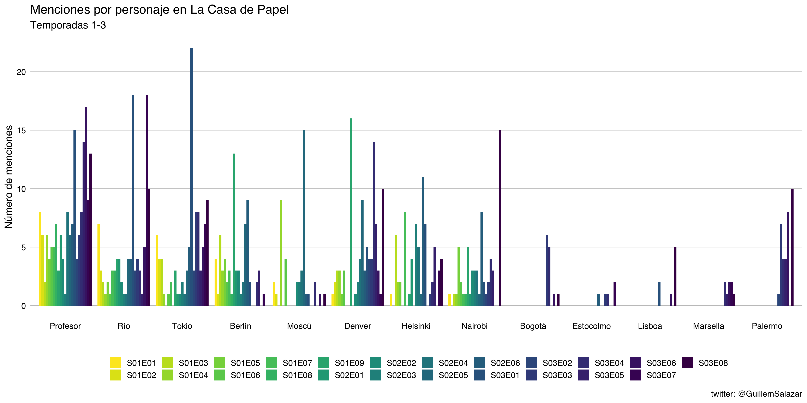

### Día 2: Gráfico de lineas (COVID-19 Google Community Mobility Report)

- Datos disponibles [aquí](https://www.google.com/covid19/mobility/)
- Consulta el código [aquí](code/dia_02.R)

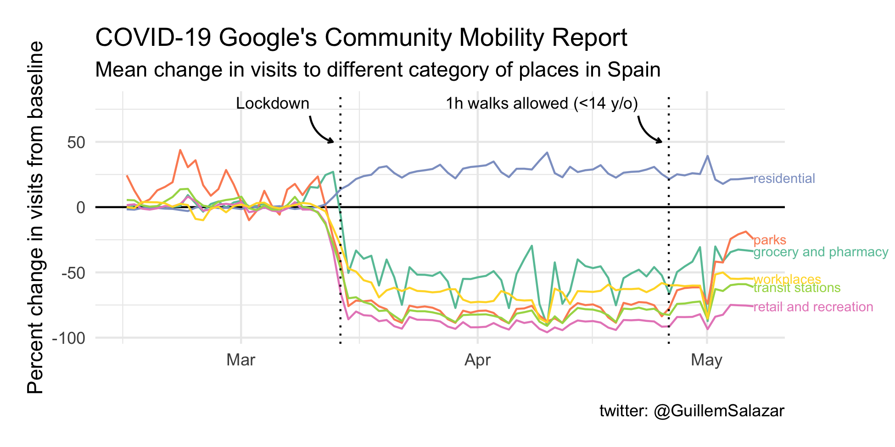

### Día 3: Gráfico de puntos (COVID-19 Google Community Mobility Report)

- Datos disponibles [aquí](https://www.google.com/covid19/mobility/)
- Consulta el código [aquí](code/dia_03.R)

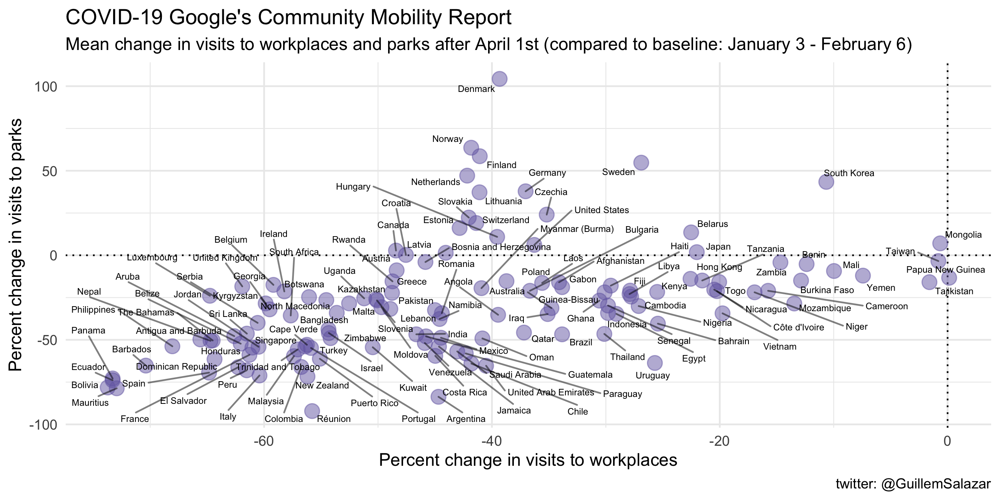

### Día 4: Gráfico con facetas (COVID-19 Google Community Mobility Report)

- Datos disponibles [aquí](https://www.google.com/covid19/mobility/)
- Consulta el código [aquí](code/dia_04.R)

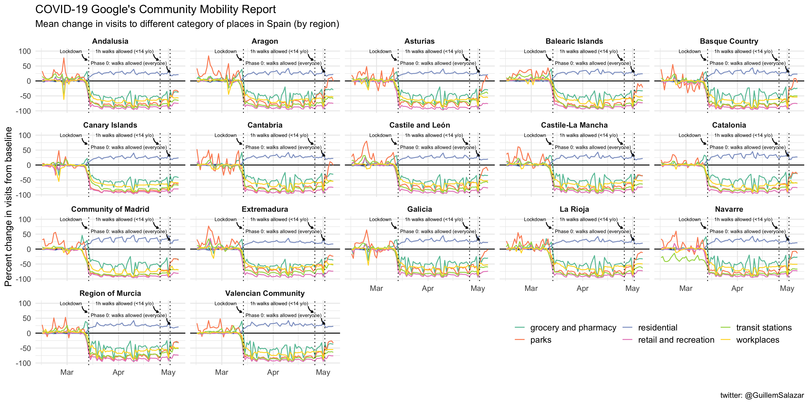

### Día 5: Gráfico de arco (Migración interautonómica)

- Datos disponibles [aquí](datos/flujo_migracion_2018.json) descargados del [INE](https://www.ine.es/jaxiT3/Tabla.htm?t=24378)
- Consulta el código [aquí](code/dia_05.R)

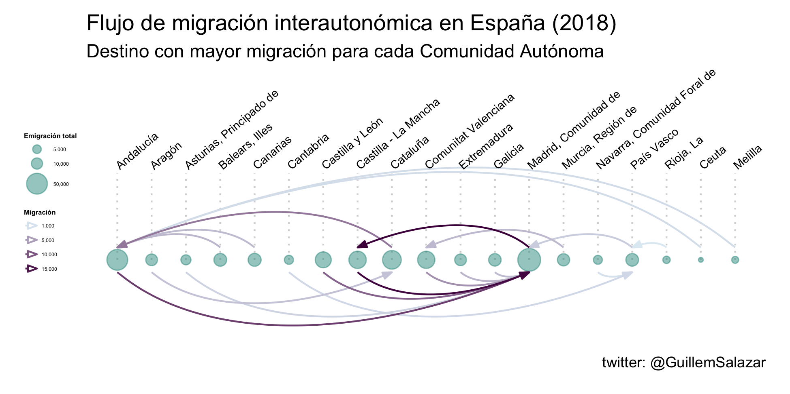

### Día 6: Gráfico de donut (Personal en I+D por sexos)

- Datos disponibles [aquí](datos/personal_id_2018.json) descargados del [INE](https://www.ine.es/jaxi/Tabla.htm?path=/t14/p057/a2018/&file=07001.px&L=0)
- Consulta el código [aquí](code/dia_06.R)

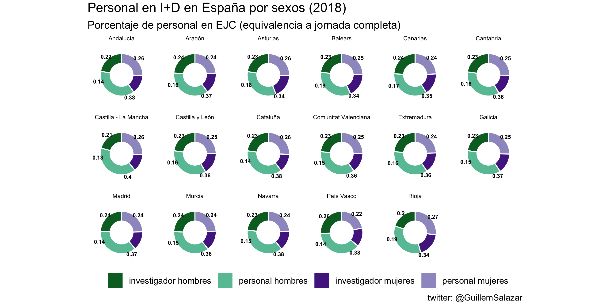

### Día 7: Gráfico *ridgeline* (COVID-19 Google Community Mobility Report)

- Datos disponibles [aquí](https://www.google.com/covid19/mobility/)
- Consulta el código [aquí](code/dia_07.R)

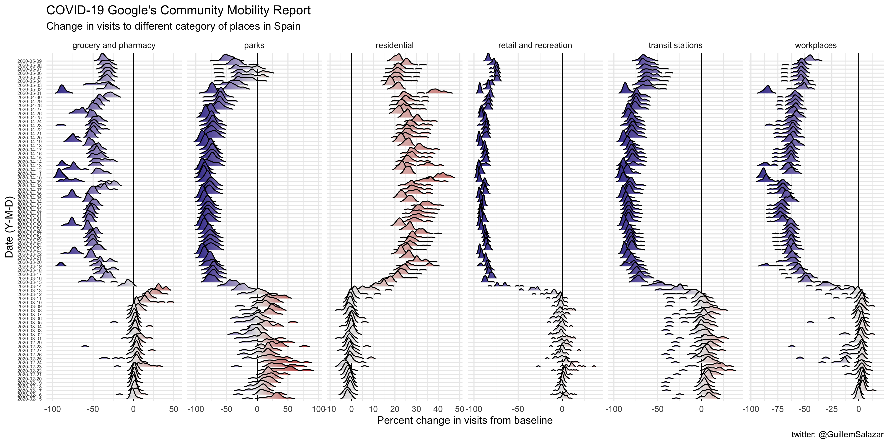

### Día 8: Gráfico de contorno (Mapa topográfico de los Pirineos)

- Datos disponibles [aquí](datos/gebco_2020_n43.68_s41.666_w-2.0_e3.2.nc) descargados de [GEBCO](https://download.gebco.net)
- Consulta el código [aquí](code/dia_08.R)

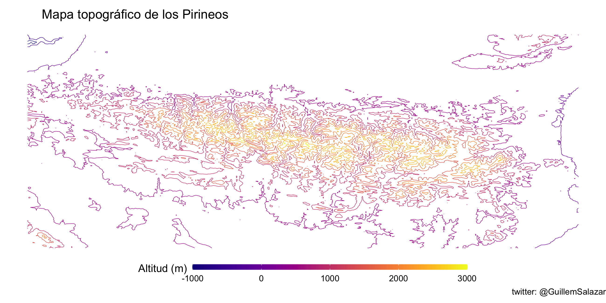

### Día 9: Gráfico de áreas apiladas (Menciones al feminismo y cambio climático en los informativos de TVE)

- Datos disponibles [aquí](https://verba.civio.es)
- Consulta el código [aquí](code/dia_09.R)

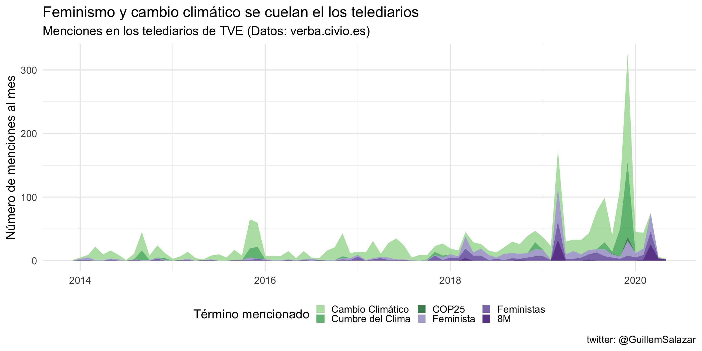

### Día 10: Explorar paletas de colores (Paletas del paquete *scico*)

- Datos disponibles en el código.
- Consulta el código [aquí](code/dia_10.R)

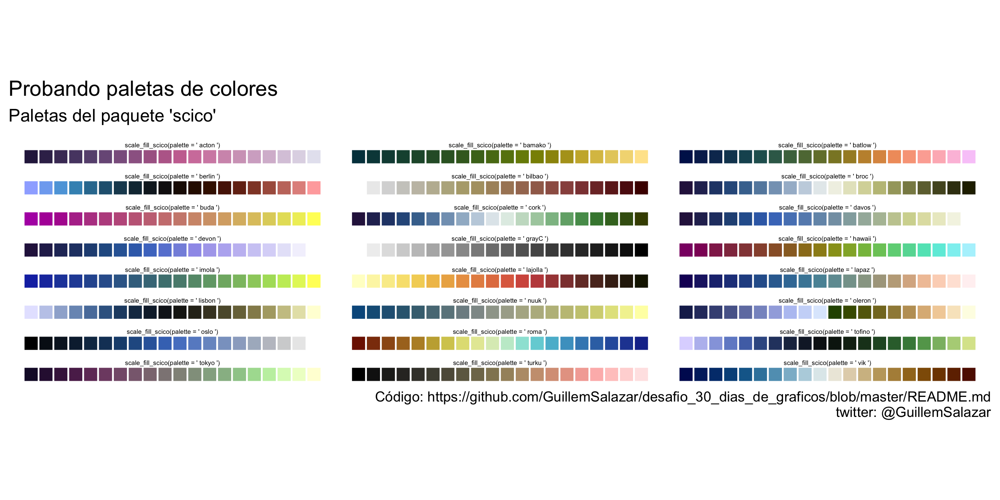

### Día 11: Mapas de calor o *heatmaps* (Menciones a políticos en los telediarios de TVE)

- Datos disponibles [aquí](https://verba.civio.es)
- Consulta el código [aquí](code/dia_11.R)

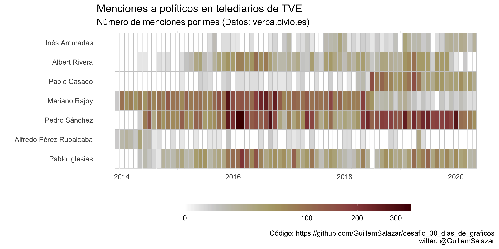

### Día 12: Gráfico de paleta (*lollipop*)  (Emisiones de CO2 en la UE)

- Datos disponibles [aquí](https://github.com/cienciadedatos/datos-de-miercoles/tree/master/datos/2019/2019-08-21)
- Consulta el código [aquí](code/dia_12.R)

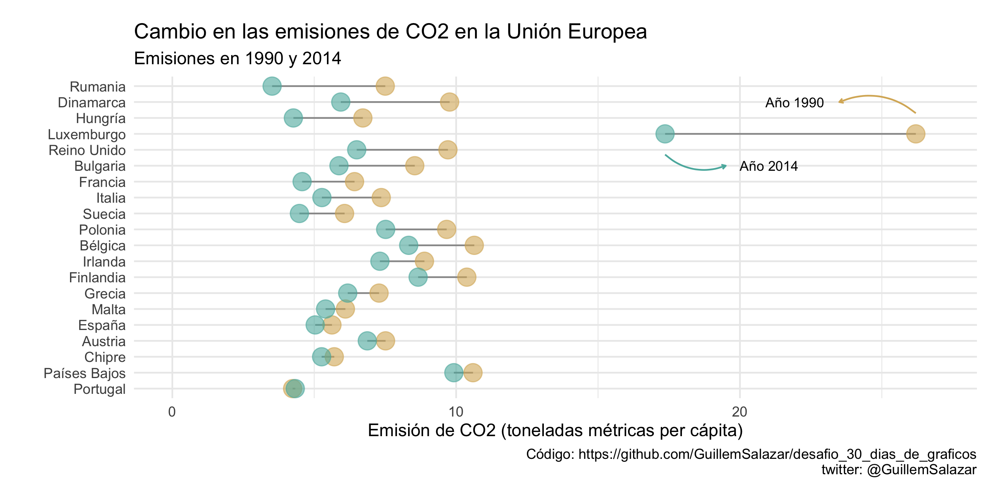

### Día 13: Visualizar datos temporales  (Temperatura en Central Park desde 1869)

- Datos disponibles [aquí](datos/noaa__ny_temp.csv) descargados de [NOAA](https://www.ncdc.noaa.gov/cdo-web/)
- Consulta el código [aquí](code/dia_13.R)

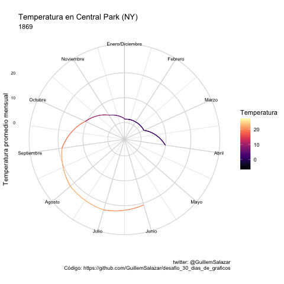

### Día 14: *Treemap*  (Parques nacionales de España)

- Datos disponibles [aquí](datos/enp) descargados del [Ministerio para la transición ecológica](https://www.miteco.gob.es/es/cartografia-y-sig/ide/descargas/biodiversidad/enp.aspx)
- Consulta el código [aquí](code/dia_14.R)

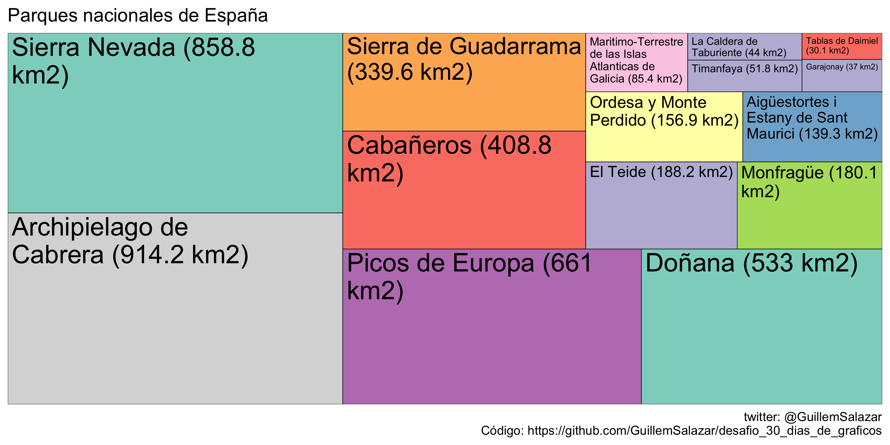

### Día 15: Dendrogramas  (COVID-19 Google Community Mobility Report)

- Datos disponibles [aquí](https://www.google.com/covid19/mobility/)
- Consulta el código [aquí](code/dia_15.R)

### Día 16: Gráficos de Waffle  (Espacios naturales protegidos)

- Datos disponibles [aquí](datos/enp) descargados del [Ministerio para la transición ecológica](https://www.miteco.gob.es/es/cartografia-y-sig/ide/descargas/biodiversidad/enp.aspx)  
- Consulta el código [aquí](code/dia_16.R)

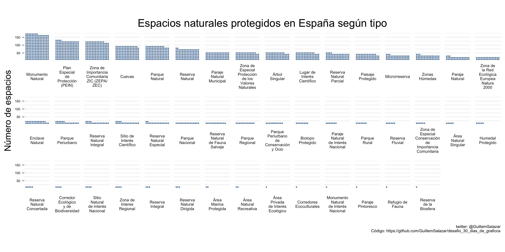

### Día 17: Sankey plot  (Paruqes nacionales)

- Datos disponibles [aquí](datos/enp) descargados del [Ministerio para la transición ecológica](https://www.miteco.gob.es/es/cartografia-y-sig/ide/descargas/biodiversidad/enp.aspx)  
- Consulta el código [aquí](code/dia_17.R)

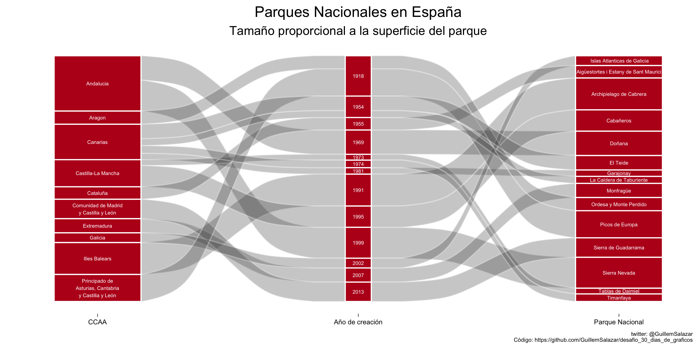

### Día 18: Visualizar datos espaciales  (Mapa de los parques nacionales y naturales en España)

- Datos disponibles [aquí](datos/enp) descargados del [Ministerio para la transición ecológica](https://www.miteco.gob.es/es/cartografia-y-sig/ide/descargas/biodiversidad/enp.aspx)  
- Consulta el código [aquí](code/dia_18.R)

### Día 19: Gráficos de flujo o *stream graph*  (Menciones a los términos *refugiados* y *Siria* en los telediarios de TVE)

- Datos disponibles [aquí](https://verba.civio.es)
- Consulta el código [aquí](code/dia_19.R)

### Día 20: Redes  (Migración interautonómica)

- Datos disponibles [aquí](datos/flujo_migracion_2018.json) descargados del [INE](https://www.ine.es/jaxiT3/Tabla.htm?t=24378)
- Consulta el código [aquí](code/dia_20.R)

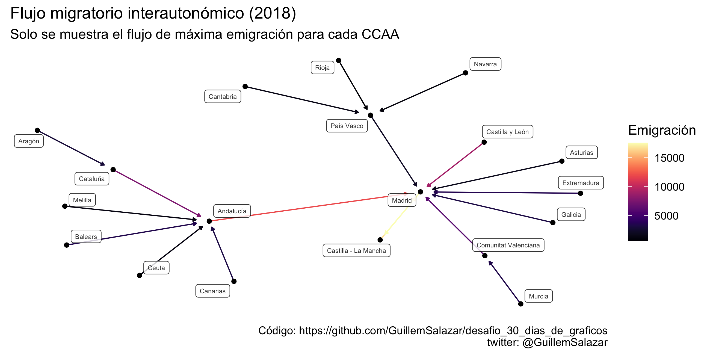

### Día 21: Gráficos con anotaciones (Menciones al término *coalición* en los telediarios de TVE)

- Datos disponibles [aquí](https://verba.civio.es)
- Consulta el código [aquí](code/dia_21.R)

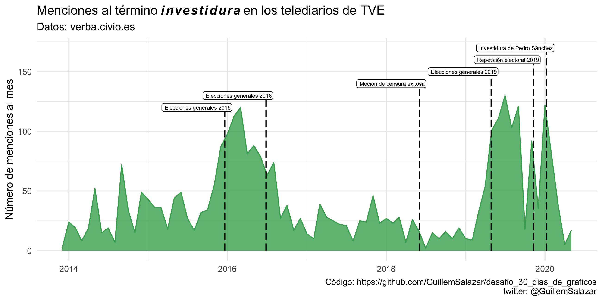

### Día 22: Análisis de datos textuales (La Casa de Papel)

- Datos disponibles [aquí](https://github.com/cienciadedatos/datos-de-miercoles/tree/master/datos/2019/2019-07-31)
- Consulta el código [aquí](code/dia_22.R)

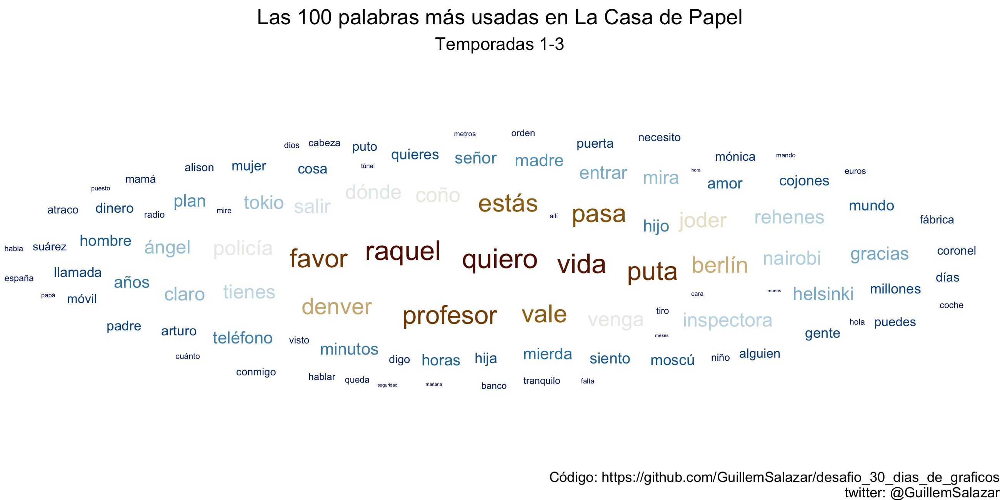

### Día 23: Sunburst graphs (La Casa de Papel)

- Datos disponibles [aquí](https://github.com/cienciadedatos/datos-de-miercoles/tree/master/datos/2019/2019-07-31)
- Consulta el código [aquí](code/dia_23.R)

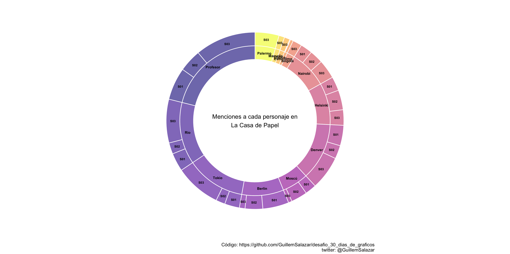

### Día 24: Coropletas (Mapa de pisos de vegetación)

- Datos disponibles [aquí](datos/series_p_tcm30-199924) descargados del [Ministerio para la transición ecológica](https://www.miteco.gob.es/es/biodiversidad/servicios/banco-datos-naturaleza/informacion-disponible/memoria_mapa_series_veg_descargas.aspx)  
- Consulta el código [aquí](code/dia_24.R)

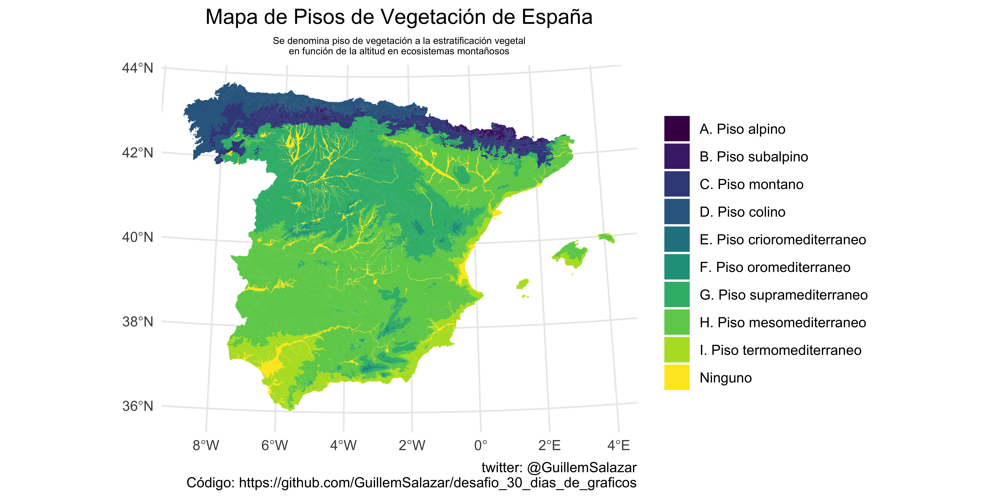

### Día 25: Gráfico de violín (Frecuencia de incendios)

- Datos disponibles [aquí](datos/frq_incendios2001-2014_dd-descarga_tcm30-199964.txt) descargados del [Ministerio para la transición ecológica](https://www.miteco.gob.es/es/biodiversidad/servicios/banco-datos-naturaleza/acceso-rapido-datos.aspx)  
- Consulta el código [aquí](code/dia_25.R)

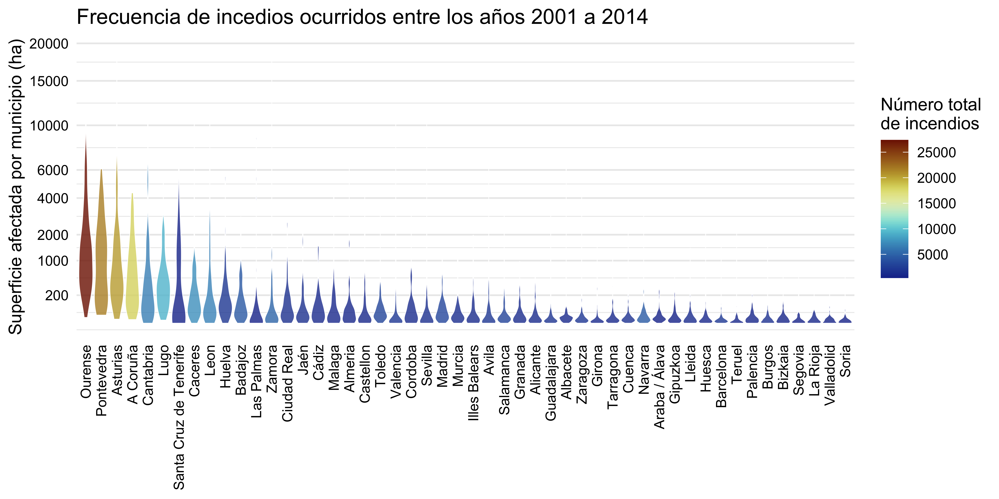

### Día 26: Diagramas de Marimekko (Personal en I+D por sexos)

- Datos disponibles [aquí](datos/personal_id_2018.json) descargados del [INE](https://www.ine.es/jaxi/Tabla.htm?path=/t14/p057/a2018/&file=07001.px&L=0)
- Consulta el código [aquí](code/dia_26.R)

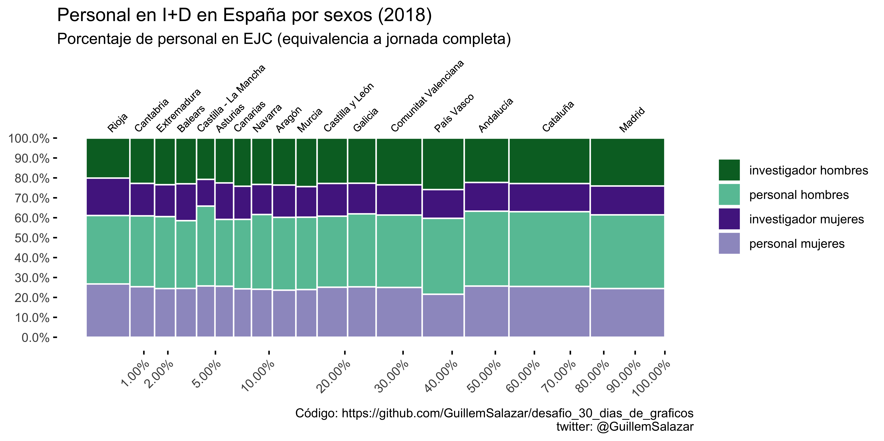

### Día 27: Gráfico animado (Producción de electricidad)

- Datos disponibles [aquí](datos/Data_Extract_From_Indicadores_del_desarrollo_mundial) descargados del [Banco Mundial](https://databank.bancomundial.org/home.aspx)
- Consulta el código [aquí](code/dia_27.R)

### Día 28: Diagrama de cuerdas  (Migración interautonómica)

- Datos disponibles [aquí](datos/flujo_migracion_2018.json) descargados del [INE](https://www.ine.es/jaxiT3/Tabla.htm?t=24378)
- Consulta el código [aquí](code/dia_28.R)

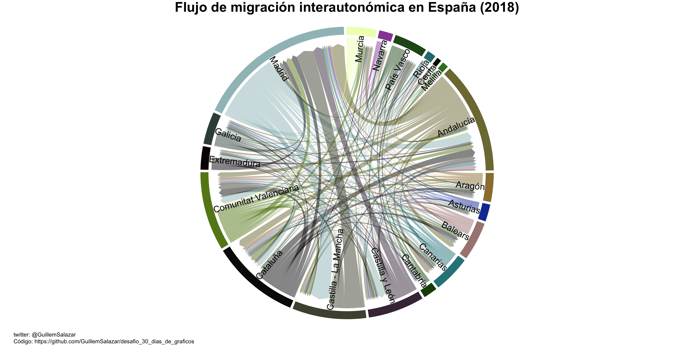

### Día 29: Gráfico de coordenadas paralelas (Producción de electricidad)

- Datos disponibles [aquí](datos/Data_Extract_From_Indicadores_del_desarrollo_mundial) descargados del [Banco Mundial](https://databank.bancomundial.org/home.aspx)
- Consulta el código [aquí](code/dia_29.R)

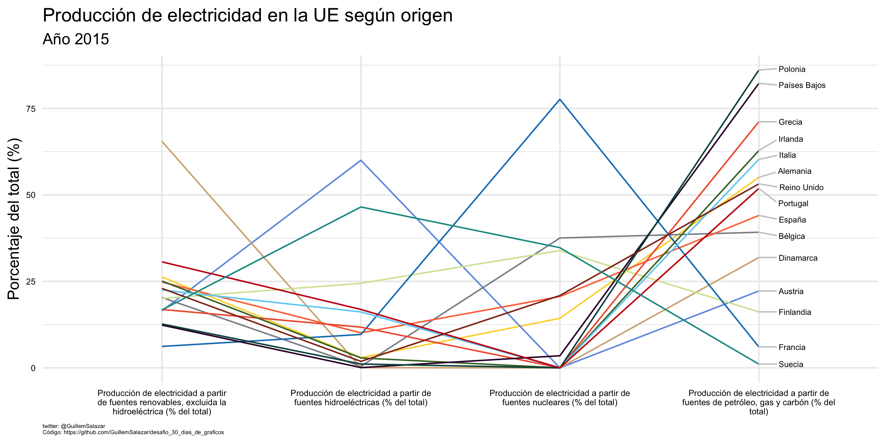